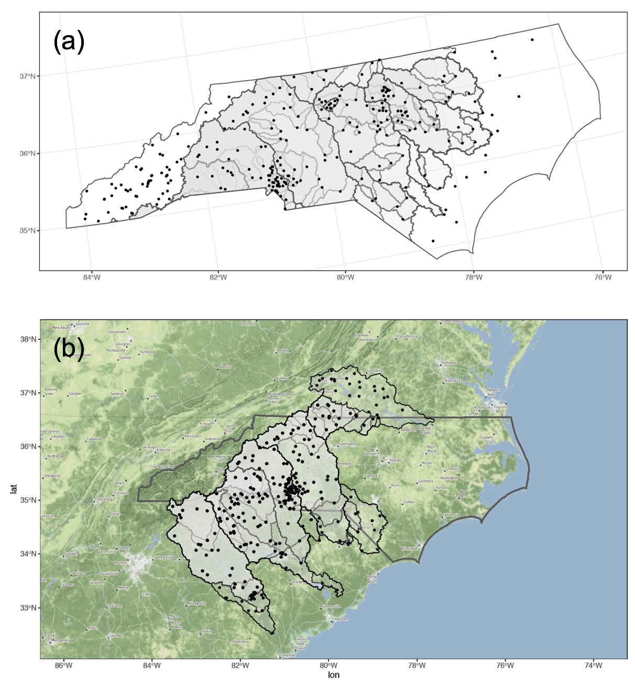
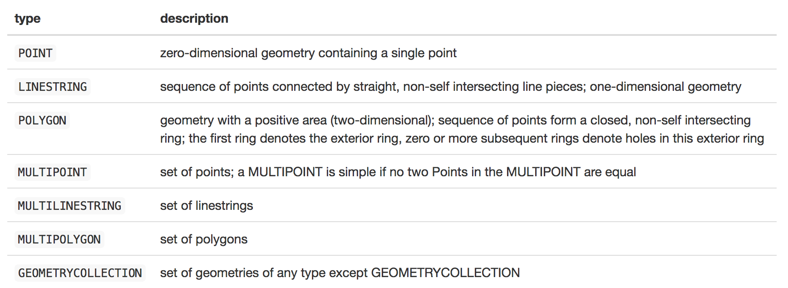
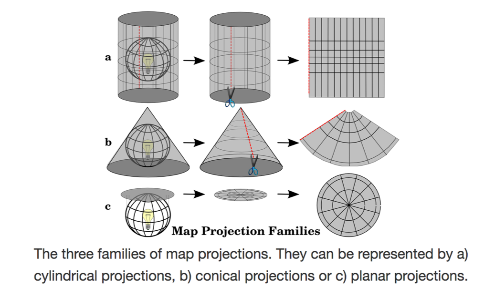
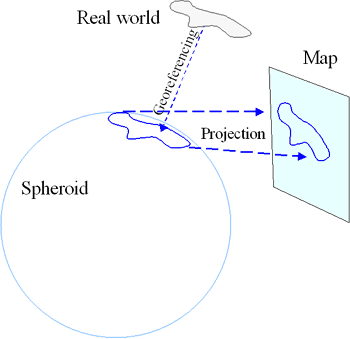
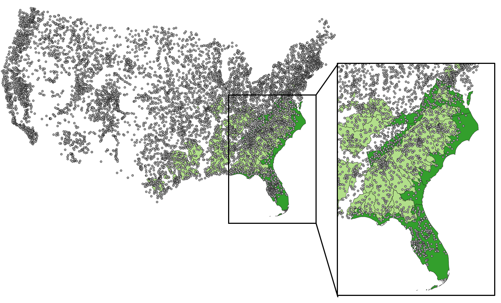

```{r setup, include = FALSE}
knitr::opts_chunk$set(eval = FALSE)
```

# 1. INTRODUCTION

This document provides an outline for class notes and code. I'll give the coding answers at the end of class, so you'll be sure to have working copies for future reference.

### 1.1 Learning Outcomes

By the end of this lesson you will be able to:

1. *Describe* what the sf package is and how to use it
2. *Explain* some different types of spatial sf objects and operations
3. *Apply* sf and tidyverse operations to real-world geospatial data

### 1.2 Test Setup

You'll be using RStudio to do coding in R. Hopefully, you have current (less than 1 year old) versions of R and RStudio installed. Please check!

If not, please [update R](https://cran.rediris.es/), [update RStudio](https://rstudio.com/products/rstudio/download/#download), and check for R package updates by going to Tools > Check for package updates... in RStudio.

```{r check.R.version}
version$version.string
```

### 1.3 Load Libraries

Go ahead and load up the primary packages for today's lesson.  You'll need the tidyverse packages readr, dplyr, tidyr, and ggplot2. For working with spatial data, make sure you have sf and ggmap. Code to check and force install these packages is not included here, so you'll need to do this yourself before this code will run or knit.

```{r load.libraries, error=FALSE, message=FALSE, warning=FALSE}
# some tidyverse packages
library("readr")
library("dplyr")
library("tidyr")
library("ggplot2")
library("purrr")
# some spatial data packages
library("sf")
library("ggmap")
# some other packages
library("here")
```

Please make sure that the pdf() command works on your computer.

```{r check.pdf}
pdf(here("outputs", "pdf_test.pdf"), width = 11, height = 8.5)
ggplot(data = cars) +
  geom_point(aes(x = dist, y = speed))
dev.off()
# it's ok to get a "null device" warning here
```

Look in your your outputs folder. You should have a file called "pdf_test.pdf" that you can open up and looks ok. If not, you'll need to ask for help.

**Activity**

Let's go on a short reproductible research asside. The here package is very helpful for reproducible research. Rather than setting your working directory you can use R projects and here to make sure that paths to files work for anyone, regardless of your operating system. Try using the here::here() command to print out a data path for some data file you have.

For expert advise/pleading on why you should use R projects and the here package see [this Twitter storm originating blogpost ](https://twitter.com/jennybryan/status/940436177219338240?lang=en) by Jenny Bryan.

```{r activity.here}
# test out here
here()
# if you've opened this script like I suggested your output should look something like
# for mac: [1] "/User/.../sf-lesson"
# for windows: [1] "C:\\...\sf-lesson"

# use here to generate a data path
# here("directory1", "directory2", "...", "file.extension")
# add your code here
```

### 1.4 What is Geospatial Data?

Geospatial data refers to any data that is associated with a location on Earth (or another planet). Usually this means that the data has coordinates (i.e., latitude and longitude or easting and northing).

Types of geospatial data:

1. points - a single coordinate combination of x and y (or longitude and latitude, respectively)
2. lines - 2 or more points form a line
3. polygons - 2 or more lines form a polygon

Here's an example spatial data figure that you could make in R.



**Activity**

Can you think of examples of point, line, and polygon data in your field?

### 1.5 Two Major Types of Spatial Data

There are two main types of geospatial data:

1. vector data - points, lines, polygons
2. raster data - pixels (grid) where each grid cell represents a single attribute value

Can you think of examples of vector and raster data in your field?

What are some example file extensions for vector and raster data (spatial and non-spatial)?

### 1.6 The Tidyverse and Spatial Data

As of November 2019, there are two major spatial data R packages that interface well with the tidyverse. These are the sf and stars packages. We'll focus primarily on the sf package in this lesson because it works well with the tidyverse. I offer a number of links at the end of this document for you to learn more about other spatial data analysis packages for R.

#### 1.6.1 sp (A Bit of History)

The *sp* package is the first iteration of an R package created to handle vector spatial data. Given the likelihood that you'll come across old code, it's helpful to be familiar with both the older sp package and it's newer version, the sf package.

**Things to Know About sp:**

* Developed in 2005
* Special objects of class SpatialData (an S4 datatype)
* Composed of lists in lists (i.e., nested lists)
* Attributes and spatial data are accessed using the @ symbol
* Not always easy to manipulate the data because not the same as a regular data frame
* When performing geographic operations, data often change class and sometimes loose their data

#### 1.6.2 sf

The *sf* package will generally operate faster and seamlessly within the tidyverse compared to the sp package, but is still in (rapid) development. Fortunately, it is very easy to move between sf and sp. You can read more about sf [here](https://github.com/r-spatial/sf).

**Things to Know About sf:**

* New in 2016 and growing rapidly
* Regular data frames with an extra list-structured geometry column that are **not** SpatialData objects but are one of three nested main sf object classes (see below) represented by S3 datatypes
* "Language independent" standard spatial data structure (ISO standard ISO 19125-1:2004: [https://www.iso.org/standard/40114.html](https://www.iso.org/standard/40114.html))
* Follow tidy data rules and will not change class (though geometry can change) and retain their data
* Tidyverse commands that work with sf objects: [https://r-spatial.github.io/sf/reference/tidyverse.html](https://r-spatial.github.io/sf/reference/tidyverse.html)
* Use spatial indexing, so many spatial query operations faster
* Cannot be used in operations that require data of class SpatialData (i.e., sp objects)

Sf objects are organized into three main classes, which you can read more about [here](https://r-spatial.github.io/sf/articles/sf1.html). In most cases these classes are nested. That is, an sf object contains an sfc object which contains a sfg object (see full description below). It is possible to convert back and forth between these summary classes using functions like st_as_sf() and st_as_sfc(). I'll discuss this more in Sections 2.6 and 2.7. 

**Main sf Geometry Classes:**

Also, sf geometries are organized into three main classes:

1. sf - the data frame that with feature attributes and feature geometries, this contains...
2. sfc - the list-column with the geometries for each record, this contains...
3. sfg - the feature geometry of an individual simple feature

There are a number of different types of "simple features" geometry types represented by the sf package (Table 1). You can read about all of these [here](https://r-spatial.github.io/sf/articles/sf1.html).



#### 1.6.3 stars

The stars package is used for handling raster and vector data. Its name stands for "spatio-temporal tidy arrays for R". You can read more about stars [here](https://github.com/r-spatial/stars).

Two caveats here are that (1) stars is still being developed and (2) it is built to be used for multi-dimensional *vector and raster* data (e.g., a 10-year long time-series of rainfall grids for the USA) called "arrays" or "data cubes". There is also the raster package, which is used for raster data only, but it does not interface well with the tidyverse. You can read more about the raster package [here](https://github.com/rspatial/raster). The mapedit package might be of interest if you're looking to edit spatial data (e.g., snapping GPS points to streams or roads). For more info on mapedit go [here](https://github.com/r-spatial/mapedit). Check out the [rspatial GitHub page](https://github.com/r-spatial) for the latest updates on all these R packages.

### 1.7 What is a coordinate reference system (CRS)?

A coordinate reference systems defines how we convert (or we can say "project") a 3D object (in this case, the Earth) to 2D surface.

There are three major types of projections:

1. cylindrical
2. conical
3. planar

This image shows what I mean by "project".



Each projection type preserves unique spatial properties. You should choose the projection you use based on what spatial property (i.e., distance, area, angle) you want to preserve. For more on this see [here](https://docs.qgis.org/testing/en/docs/gentle_gis_introduction/coordinate_reference_systems.html#figure-projection-families).

You might have also heard the word "datum". Some example datums include WGS84 or NAD83. A datum is the reference surface (usually an spheroid) that anchors a CRS. The WGS84 datum is a 3D reference surface (usually in latitude and longitude) while NAD83 is a 2D (projected) reference surface (usually in distance units like meters).

Figure 3 shows how a datum defines a spheroid that forms the reference surface for real-world spatial data. This data can then be projected onto a 2D surface (i.e., a map).



#### 1.7.1 An !Important! Note About Coordinate Reference Systems (CRSs)

**R does not manage CRS "on the fly"**, so the onus is on you to manage the CRS (and extent, resolution, etc.) of your data. Many times this will mean that when attempting to work with two or more data (e.g., extract values to points from a set of shape files), you will get an error message that the data do not share projects and/or they do not align. Often you can also not get an error message but your data might not be showing up on your map correctly (e.g., spatial boundaries are not lining up).

I find CRS management to be one of the time consuming parts of spatial data work in R. At the start of any spatial data project, you may wish to establish a set of reference data objects (e.g., snapshp.shp) to serve as a template for the official projection, extent, origin, resolution, etc.  When you import any data to R, you should always check if it matches snapshp.shp and, if not, proceed to reproject, crop, clip, resample, align…. Whatever steps are necessary to make it conform to the project template.

#### 1.7.2 CRS Representation in sf

There are two main ways to define a CRS in sf:

1. proj4 string - a character string with CRS info
2. EPSG code - a standard numeric code that defines a projection type

As long as one of these is defined, you can move on. However, if you want to define both, that might prove less confusing to your future-self. :)

#### 1.7.3 Coordinate Systems Websites

Various websites provide free services to look-up CRS definitions, characteristics, and transformations

Most provide one or more of the following: 

* a short permanent link
* opportunity to export CRS definition in various formats (WKT, XML, OGC GML, Proj.4, JavaScript, SQL)
* a numeric reference code (i.e., EPSG code) that can be used in place of a fully specified CRS

Some suggested websites:

1. [https://epsg.io/](http://www.epsg-registry.org/) - open source nicer user interface to access data in the EPSG registry, includes a little transformation calculator too! and proj4 string generator, this is my go-to CRS look-up database
2. [https://spatialreference.org/ref/epsg/](https://spatialreference.org/ref/epsg/)
3. [http://www.epsg-registry.org/](http://www.epsg-registry.org/) - official database, but ugly slow interface

#### 1.7.4 Common CRS for US & European Data

**EPSG:4326**

WGS 84 or WGS84 (World Geodetic System 1984, used in GPS)
[http://epsg.io/4326](http://epsg.io/4326)

**EPSG:54024**

ED50 (European Datum 1950, used in EU GPS)
[http://epsg.io/54024](http://epsg.io/54024)

**EPSG:102013**

NAD83 / Europe Albers Equal Area Conic
[http://epsg.io/102013](http://epsg.io/102013)

**EPSG:various UTM**

Universal Transverse Mercator (UTM)
You need to find your UTM zone and then determine EPSG from there. To look up your zone go to [this website](https://mangomap.com/robertyoung/maps/69585/what-utm-zone-am-i-in-#).

**EPSG:102014**

ED50 / Europe Lambert Conformal Conic
[http://epsg.io/102014](http://epsg.io/102014)

**EPSG:54024**

WGS84 / World Bonne
[http://epsg.io/54024](http://epsg.io/54024)

#### 1.7.5 A Quick Reference for CRSs in R

National Center for Ecological Analysis and Synthesis created a CRS summary sheet.  Useful quick reference as well as background if you don't have much knowledge of all the various choices presented.

[https://www.nceas.ucsb.edu/~frazier/RSpatialGuides/OverviewCoordinateReferenceSystems.pdf](https://www.nceas.ucsb.edu/~frazier/RSpatialGuides/OverviewCoordinateReferenceSystems.pdf)

# 2. READING IN DATA

### 2.1 Data Background

The data we'll use in this lesson comes from the United States Geologic Survey (USGS). Specifically, the dataset is called the Geospatial Attributes of Gages for Evaluating Steamflow, version 2 (GAGES-II) available [here](https://water.usgs.gov/GIS/metadata/usgswrd/XML/gagesII_Sept2011.xml). GAGES-II provides geospatial data and classifications of 9,322 stream gages that are maintained by the USGS. It includes: (1) watershed boundaries by region (spatial data), (2) USGS stream gage locations (spatial data), (3) watershed characteristics (tabular data). Note that the term "watershed" is used interchangeably with the word "basin".

We'll also being using Southeast state boundary data from the United States Census Bureau.

Here is what the spatial data for this lesson looks like (Figure 4). Southeast state boundaries are shown in dark green, watershed boundaries are shown in light green, and stream gage locations are shown as grey points.



### 2.2 Loading in the Data

Start by reading in the basin boundaries for non-reference (i.e., notable human impact) for the Southeast Plains using `st_read()` from the sf package. Notice how you only call the .shp file here. You don't need to include all the other files that come along with the .shp file (i.e., .prj, .sbn, .shx, .sbx, .dbf, etc.).

```{r read.in.some.data}
basins_nf_seplains_raw <- st_read(here("data", "spatial_data", "bas_nonref_SEPlains.shp"))
# note how I'm using the here package!
```

**Activity**

Now you practice loading in:

1. GAGES-II stream gage points (gagesII_9322_sept30_2011). Name these data "gages_raw".
2. The boundary lines of US states (southeast_state_bounds). Name these data "southeast_state_bounds_raw".
3. One of the GAGES-II tabular data. Hint: Think back to other classes for this one. Also see the README.md file in the tabular data folder for a full description of each GAGES-II tabular data file.

I like to always save a copy of the raw data in my R session and rename all new variables I make from it with new names. That way, I can always look back to the original.

```{r activity.load.data}
# complete the code below
gages_raw <- st_read(here("data", "spatial_data", "gagesII_9322_sept30_2011.shp"))
southeast_state_bounds_raw <- st_read(here("data", "spatial_data", "southeast_state_bounds.shp"))
my_tabular_data_raw <- read_csv(here("data", "tabular_data", "conterm_climate.txt"))
```

### 2.3 Familiarizing Ourselves with the Data

Now that you've loaded in these data, take a look at their format, information included, etc.

**Activity**

Use base R commands to answer the following questions (for basins_nf_seplains_raw):

1. What is the class?
2. What are the names of each column? 
3. How many columns are there?
4. What are the attributes?
5. Show the first several lines of these data.

```{r activity.check.out.data}
# add your code here
class(basins_nf_seplains_raw)
names(basins_nf_seplains_raw)
length(names(basins_nf_seplains_raw))
head(basins_nf_seplains_raw)
```

While not in base, you can also use glimpse() from the tibble (tidyverse) package to look at basin_nf_seplains_raw.

With respect to question 5th above, you might notice some interesting outputs that aren't usually there: geometry type, dimension, bbox, EPSG, and proj4string. There are included there because basins_nf_seplains_raw is a spatial data. Some of these we've talked about before (i.e., EPSG and proj4string).

The *geometry* columns is what defines the spatial aspect of these data and make it a sf object. If there were no geometry column basin_nf_seplains_raw would just be a data.frame or tibble.

### 2.4 Checking CRSs

The sf package contains the st_crs function which allows you to look at the CRS of your spatial data.

**Activity**

Use st_crs() to look at the CRSs of the spatial data you have loaded up so far. What are the CRSs for each? Do they all have complete EPSG or proj4 strings?


```{r activity.check.out.data.again}
# add your code here
st_crs(basins_nf_seplains_raw)
st_crs(gages_raw)
st_crs(southeast_state_bounds_raw)
```

### 2.5 Setting and Projecting CRSs

Now that you've checked the CRSs of your spatial data, you can either set or project them so they are compatible with one another. When *setting* a CRS, you're labeling the spatial data with a CRS it already has but is not showing up when you load the data into R. Setting also includes defining a missing ESPG or proj4 string; if one is complete but the other is not. When *projecting* a CRS, you're converting the spatial data from one CRS to another. For the sf package, transform is used interchangeably with project. It's important know the difference between setting and projecting!

Set a CRS by:

1. Defining proj4 string using st_crs(<data>) <- "<known proj4string>"
2. Defining EPSG string using st_crs(<data>) <- <known ESPG code> or using st_set_crs(<known EPSG code>) in a pipe like new_data <- raw_data %>% st_set_crs(5070)

Project a CRS by:

1. Using st_transform(x = <data>, crs = <new CRS proj4 string>)

I noticed if you tried to define proj4text inside st_crs() your data is converted to class CRS (not sf). The same thing happens if you set value to the proj4 string or EPSG code. I'm not sure why changing the data to a CRS object is the default. Also, sometimes its helpful to define your proj4 string or EPSG code as a variable like my_proj4 or my_epsg so you can use it throughout your code without having to change it every time.

#### 2.5.1 A Note on Figuring Out CRS Information

You can always use [espg.io](http://epsg.io/) for help or open up the spatial data in your favorite GIS software, if you really get stuck. For example, QGIS gives the ESPG code of spatial data in the lower right-hand corner (assuming it is defined). If it is not defined, you should visit the documentation associated with the spatial data for the CRS information.

**Activity**

All three datasets have the same projection but different some elements are missing. Use the commands above to define a new variable (remove "raw" from the end) representing each of the three spatial datasets with both a proj4 string and EPSG code representing the USGS's Continental United States Albers Equal Area Conic NAD83 (proj4 = "+proj=aea +lat_1=29.5 +lat_2=45.5 +lat_0=23 +lon_0=-96 +x_0=0 +y_0=0 +ellps=GRS80 +towgs84=0,0,0,0,0,0,0 +units=m +no_defs" and ESPG = 5070).

Pick one of the three datasets, define a new variable with "na_albers" at the end, use the commands above to project it to North America Albers Equal Area Conic. Hint: You can use [espg.io](http://epsg.io/) for help.

Last, check the CRSs of each.

```{r activity.setting.projecting}
# define proj4 string and EPSG code
# complete the code below
my_proj4 <- "+proj=aea +lat_1=29.5 +lat_2=45.5 +lat_0=23 +lon_0=-96 +x_0=0 +y_0=0 +ellps=GRS80 +towgs84=0,0,0,0,0,0,0 +units=m +no_defs"
my_epsg <- 5070

# setting projections
# set the proj4 string first and then set the EPSG code (because proj4 will over-ride EPSG if you set EPSG first)
# add your code here
st_crs(basins_nf_seplains_raw) <- my_proj4

basins_seplains <- st_set_crs(basins_nf_seplains_raw, crs = my_epsg)

basin_seplains <- basins_nf_seplains_raw %>%
  st_set_crs(my_epsg)

# projecting to North America Albers Equal Area Conic
# add your code here
na_albers_proj4 <- "+proj=aea +lat_1=20 +lat_2=60 +lat_0=40 +lon_0=-96 +x_0=0 +y_0=0 +ellps=GRS80 +datum=NAD83 +units=m no_defs"
na_alber_epsg <- 102008

# check CRSs
basin_seplains_albers <- sf::st_transform(basin_seplains, crs = na_albers_proj4)
  
```

### 2.6 Converting sp Objects to sf Objects and Vice Versa

If you're using other (likely older) types of spatial data, R may not recognize them as sf objects. For example, a collaborator may give you some older code that uses the sp package to generate spatial data. First, make sure to double check the class using class(). If the object is not an sf object, you can use st_as_sf() or st_as_sfc() to convert your data to sf or sfc objects.

Also, you can use the command as_Spatial() to convert sf objects back to sp SpatialData objects. This might be important for you if you're working with a collaborator that uses older sp package code.

### 2.7 Converting From One sf Geometry Type to Another

In some cases, you might want to convert (or "cast") from one geometry type to another. For a complete list of sf geometry types see Section 1.6.2 (Table 1). To cast from one sf geometry type to another you can use the st_cast() command. You have to explicitly define what type of geometry you want to cast to.

### 2.8 Converting Tabular Data to Spatial Data

What if you don't have a .shp file; instead, you have tabular data with spatial variables in columns? You're in luck! There are ways to convert tabular data to sf objects. 

Commands to convert tabular data to corresponding sf objects:

1. st_point()
2. st_multipoint()
3. st_linestring()
4. st_multilinestring()
5. st_polygon()
6. st_multipolygon()

```{r tabular.to.sf }
# read in GAGES-II data in tabular format
gages_tabular <- read_csv(here("data", "tabular_data", "gagesII_sept30_2011_tabular.csv")) %>%
  as.data.frame() # use this to drop the tibble classes (i.e., tbl_df and tbl)

# look at class
class(gages_tabular)

# use names() to get spatial data columns
names(gages_tabular)
# LAT_GAGE is y value and LNG_GAGE is x value

# convert to sf object
gages_tabular_as_sf <- st_as_sf(gages_tabular, coords = c("LNG_GAGE", "LAT_GAGE"), crs = 4326, dim = "XY") # lat long so set CRS = WGS84

# check class and CRS
class(gages_tabular_as_sf)
head(gages_tabular_as_sf)
st_crs(gages_tabular_as_sf)

# check by plotting (more on plotting below)
pdf(here("outputs", "tabular_to_sf_check.pdf"), width = 11, height = 8.5)
ggplot() +
  geom_sf(data = gages_tabular_as_sf) +
  theme_bw()
dev.off()
# seems to work just fine!
```

It looks like you can also manually make a "geometry" column using your standard tidyverse functions and use this to convert from a tabular data format to a sf format. See [this GitHub issue](https://github.com/r-spatial/sf/issues/385) for more information.

# 3. USING THE DATA

### 3.1 Spatial Data Operations

There are numerous spatial operations, we can run on spatial data.

**Activity**

What are some things you might want to do with the three spatial datasets we have here? Brainstorm these with a partner and if you have time, look through the sf package help to see what types of commands you might use.

For example, you might want to select a state from southeast_state_bounds and find it's area. You might want to find how many gages are inside that state.

#### 3.1.1 A Note on Spatial Geometry

In some cases, we might not necessarily need the tabular data associated with a spatial dataset. For example, say you decide that you just want to look at GAGES-II data in North Carolina. Once you have the boundary lines for North Carolina you might not need all the spatial data associate with it. You can remove the tabular data using the st_geometry() command.

```{r isolating.geometry}
# tabular data is attached
head(southeast_state_bounds)
southeast_state_bounds_geometry <- st_geometry(southeast_state_bounds)

# tabular data is dropped
head(southeast_state_bounds_geometry)

# notice the class is different now
class(southeast_state_bounds_geometry)
# it's an sfc class, specifically an sfc_MULTIPOLYGON class
```

In other cases, you might just want to keep the tabular data (attributes) associated with spatial data. To remove geometry you can use the st_drop_geometry() command.

```{r dropping.geometry}
# geometry data is attached
head(southeast_state_bounds)
southeast_state_bounds_tabular <- st_drop_geometry(southeast_state_bounds)

# geometry data is dropped
head(southeast_state_bounds_tabular)

# notice the class is different now
class(southeast_state_bounds_tabular)
# it's a data.frame class, we could convert to a tibble using as_tibble()
```

#### 3.1.2 Common Spatial (Geometric/Geometry) "Operations"

Some common sf spatial operation commands might include (in no special order):

1. st_transform() - We've seen this before. Projects from one CRS to another.
2. st_area() - Calculates the area of a polygon.
3. st_centroid() - Finds the centroid (x-y coordinate) of a polygon or combined geometry.
4. st_difference() - Removes overlapping spatial data between two datasets.
5. st_intersection() - Finds overlapping spatial data between two datasets where output is an sf object that's clipped to the boundary of the intersected dataset.
6. st_simplify() - Makes a simpler version of a geometry based on a given tolerance. This helps reduce file size and speed up visualization loading.
7. st_snap() - Snaps points or nodes to a second spatial dataset.
8. st_buffer() - Creates a polygon extending from a geometry within a given distance.
9. st_boundary() - Finds a polygon that encompasses the full extent of the geometry.
10. st_crop() - Makes a geometry that intersects a specified rectangle, where the rectangle can be the greatest rectangular boundary of the dataset provided
11. so many others...

I'm distinguishing these from Spatial (Geometric) "Confirmations" which are similar operations but the output is a list object rather than a sf object. For example, st_intersects() and st_within(). See the sf cheatsheet for more information on this.

Also, sometimes the differences between these operations can be confusing/not obvious so what I tend to do is try them out and then plot the result to make sure it's doing what I think it's doing. If it's not, then you can trouble-shoot from there.

**Activity**

Use your knowledge of sf and the tidyverse to select a single state from southeast_state_bounds. Next, drop the geometry and use the state boundary to select watersheds and stream gages that intersect with the state.

Bonus: What are some other spatial operations (or confirmations) that you could carry out with the three spatial datasets?

```{r activity.gages.select}
# select a state
florida <- southeast_state_bounds %>%
  filter(NAME == "Florida")

# check
glimpse(florida)

# select watersheds that intersect with NC bounds
# add your code here

# check
# add your code here

# select gages that fall within NC bounds
fl_gages <- st_intersection(gages, florida)

# remove attributes from fl boundary
fl_geometry <- st_geometry(florida)

# ggplot
pdf(here("outputs", "florida_gages.pdf"), width = 11, height = 8.5)
ggplot() +
  geom_sf(data = fl_geometry) +
  geom_sf(data = fl_gages, aes(color = DRAIN_SQKM)) +
  theme_bw()
dev.off()


# bonus
# add your code here

```

I've found that it's really helpful to actually plot these results before moving forward with your work. That way you an make sure the sf commands are doing what you expect. We'll talk about plotting next...

### 3.2 Visualizing Data

#### 3.2.1 Viz Basics

An import part of spatial data analysis is to *check your work* and also *share your results*. The sf package makes this very easy by adding a geom_sf() to add a vector data layer and geom_sf_text() to add a label layer to any ggplot2 object.

Usually I use RStudio to visualize all of my plots but since spatial data often has a large file size, it can take a while to load in the built-in RStudio plotting window. Until the folks at RStudio and sf package developers deal with this, I recommend exporting your spatial visualizations to PDF files in a dedicated folder. Here, we'll practice exporting our plots to the "outputs" folder. Make sure you run all lines of code starting from pdf() to dev.off(). The pdf() will write and open a new empty PDF file and dev.off() will close it. It's ok to get a "null device" message here. R is just telling you that it closed the pdf file it created.

```{r basic.sf.plotting}
# basic plot
pdf(here("outputs", "southeast_state_bounds.pdf"), width = 11, height = 8.5)
ggplot() +
  geom_sf(data = southeast_state_bounds) + # you can add color = "blue" to change outline color to blue or lwd = 2 to change the width of the lines
  theme_bw() # I like to add this to make the background white and not grey
dev.off()

# adding labels
pdf(here("outputs", "southeast_state_bounds_with_labs.pdf"), width = 11, height = 8.5)
ggplot(data = southeast_state_bounds) + # Notice I moved this up here so I don't have to keep calling it
  geom_sf() +
  geom_sf_text(aes(label = NAME), color = "blue") +
  theme_bw()
dev.off()

# adding fill by a second variable
pdf(here("outputs", "southeast_state_bounds_by_area.pdf"), width = 11, height = 8.5)
ggplot(data = southeast_state_bounds) +
  geom_sf(aes(fill = Shape_Area)) +
  geom_sf_text(aes(label = NAME), color = "white") +
  theme_bw()
dev.off()
```

**Activity**

Let's check your operations from the 3.1.2 activity. You are trying for something like Figure 1a. Are the spatial operation results working as you'd expect? Test out running other operations (i.e., st_crop() and st_contains()) and plotting them to better understand what those do.

```{r activity.checking.operations}
# plot watershed boundardies from 3.1.2
pdf(here("outputs", "spatial_operations_test_fig"), width = 11, height = 8.5)
# add your code here

dev.off()
```

Notice a few things about Figure 1a: (1) the watersheds are nested (there are smaller ones inside bigger ones), (2) the larger watersheds are cut by the state boundaries, and (3) there are some gages that are outside the watershed bounds (i.e., we don't have watershed basins or tabular data for them).

#### 3.2.2 Adding Base-Maps

Basemaps are available to help you give more context to your maps. This is made possible using the ggmap package.

```{r adding.basemaps}
# select North Carolina (NC)
nc_state_bounds_geom <- southeast_state_bounds %>%
  filter(NAME == "North Carolina") %>%
  st_geometry()
# if I wanted Florida instead, what would I need to do?

# get data bounding box
nc_bbox <- nc_state_bounds_geom %>%
  st_buffer(dist = 150000) %>% # this value is very arbitrary just wanting to make a large buffer around geometry
  st_transform(4326) %>% # WGS84 (for lat and long)
  st_bbox()
nc_bbox # check

# fix bounding box columns so they match what is needed for the ggmap::get_map() function
nc_bbox_fix <- c(left = nc_bbox[[1]], bottom = nc_bbox[[2]], right = nc_bbox[[3]], top = nc_bbox[[4]])

# check result
nc_bbox_fix

# get basemap
nc_basemap <- get_map(nc_bbox_fix, maptype = 'terrain-background', source = 'stamen', zoom = 8)
# this will have a CRS = WGS84

# convert nc_state_bounds_geom to WGS84 so it matches nc_basemap
nc_state_bounds_geom_wsg84 <- nc_state_bounds_geom %>%
  st_transform(4326)

# check
st_crs(nc_state_bounds_geom_wsg84)

# plot without basemap
pdf(here("outputs", "nc_without_basemap.pdf"), width = 11, height = 8.5)
ggplot() +
  geom_sf(data = nc_state_bounds_geom_wsg84, fill = NA, lwd = 2) +
  theme_bw()
dev.off()

# plot with basemap
# windows version?
pdf(here("outputs", "nc_with_basemap.pdf"), width = 11, height = 8.5)
ggmap(nc_basemap) +
  geom_sf(data = nc_state_bounds_geom_wsg84, fill = NA, lwd = 1, inherit.aes = FALSE)
dev.off()
```

**Activity**

Can you reproduce Figure 1b?

```{r activity.reproducing.figure1b}
# select NC
# add your code here

# make figure 1b
# find watersheds that overlap with NC (want the whole watershed, not just the part of the watershe that's inside the NC bounds)
# add your code here

# look at result
# add your code here

# hint: make a function to convert binary to logic
binary_logic_converter <- function (x) {
  if (length(x) == 1) {
    return(TRUE)
  } else {
    return(FALSE)
  }
}
# source: http://rpubs.com/sogletr/sf-ops

# map function on data and select only true values
# add your code here

# look at result
# add your code here

# use nc_basins_overlap_logic to select only watersheds that overlap
# add your code here

# check class
# add your code here

# select Southeast gages only
# add your code here
# stretch break...this might take a while to run

# use nc_basins_overlap_sel to find gages inside
# add your code here
# stretch break...this might take a while to run

# convert all data to WGS84
# add your code here

# plot figure 1b
pdf(here("outputs", "figure_1b.pdf"), width = 11, height = 8.5)
# add your code here

dev.off()
```

### 3.3 Mixing Spatial and Tabular Data

The sf and tidyverse packages work together very well to wrangle spatial and tabular data. You may have noticed that some of the code above uses the pipe operator (i.e., %>%) to link together analysis steps. Some of the dplyr verbs will also work with sf objects See [here](https://r-spatial.github.io/sf/reference/tidyverse.html) for more info on these verbs.

Let's try an example. Here we'll select all the gages in NC, join them with one of the GAGES-II tabular datasets, and create a map that colors these gage locations by a particular variable in the tabular dataset. We might want to do this as the start of spatial trend analysis.

```{r joining.gage.data}
# Use the NC state boundary we used earlier to select all the stream gages in NC
nc_gages <- gages %>%
  st_intersection(nc_state_bounds_geom)

# take a look at ng_gages
head(nc_gages)
names(nc_gages)
# we see there are some variables we could color by but the tabular data has many more

# take a look at my_tabular_data_raw
names(my_tabular_data_raw)
# I'm choosing the climate data and am going to use the WD_SITE variable. This is the "Site average of annual number of days (days) of measurable precipitation, derived from 30 years of record (1961-1990), 2km PRISM.". This description comes from the gagesII_sept30_2011_var_desc.xlsx file in the tabular data directory.

# check column names of nc_gages to look for joining key
names(nc_gages)
# use "STAID"

# join the tabular data to nc_gages
nc_gages_climate <- nc_gages %>%
  left_join(my_tabular_data_raw, by = "STAID")

# check that it worked
names(nc_gages_climate)
# looks good!

# plot WD_SITE for each gage location
pdf(here("outputs", "nc_gages_by_tabular_data.pdf"), width = 11, height = 8.5)
ggplot() +
  geom_sf(data = nc_gages_climate, aes(color = WD_SITE), size = 3) +
  scale_color_gradient(low = "white", high = "blue") +
  labs(color = "Gage Avg. Annual # Days with Precipitation") +
  geom_sf(data = nc_state_bounds_geom, fill = NA) +
  theme_bw()
dev.off()
```

Looks like we have some emerging patterns in average number of days per year with precipitation at the stream gage. We'd have to do some spatial modeling to verify this. It's notable that the Appalachian Mountains are located in the western part of the state, which is where we see the highest number of days per year with precipitation.

**Activity**

Practice joining other types of tabular data onto the spatial datasets provided here. Hint: You can rename the the GAGE_ID column from the basins_nf_seplains dataset to STAID to join the tabular data to each basin.

```{r activity.joining.basin.data}

# use overlapping watersheds from 3.2.2 (or from 3.1.2 if you didn't do 3.2.2)
# add your code here

# join tabular data
# add your code here

# check result
# add your code here

# plot
pdf(here("outputs", "basins_by_tabular_data.pdf"), width = 11, height = 8.5)
# add your code here

dev.off()
```

# 4. SAVING DATA

To save sf data to .shp files or other spatial file types, use the st_write() command. You'll notice it will also make all the other file extensions required for the .shp file.

```{r saving.data}
# save nc_state_bounds_geom
st_write(nc_state_bounds_geom, here("outputs", "nc_boundary.shp"))
```

Look in your output directory to make sure your shp file is there!

**Activity**

Try saving another spatial dataset you created in Sections 3.1 or 3.3.

```{r activity.saving.more}
# use st_write(<variable name>, <file path.shp>)

```

# 5. EXTRA FEATURES & RESOURCES

### 5.1 Other Interesting Spatial Packages

**ggsn package**

I haven't played around with adding compass roses, scale bars, and all these other important map elements. While not reproducible (I admit!), I will typically export to PDF and then do my edits in Inkscape (think open-source Adobe Illustrator). If you're really wanting to do this in a reproducible way, looks like you can use the [ggsn package](http://oswaldosantos.github.io/ggsn/) in R.

**raster package**

I definitely recommend using the raster package if you have to do any raster spatial data analysis. However, be warned that this package is currently not very friendly with tidyverse packages.

**parallel and doParallel packages**

If you have a big spatial dataset you might need to implement parallel computing. You can use these packages to do that.

**tmap package**

This package is great package for making maps. I didn't have enough time to cover it but I recommend checking it out. More information [here](https://github.com/mtennekes/tmap).

**leaflet and mapview packages**

You can use these packages to make your maps interactive. See more information about leaflet [here](https://rstudio.github.io/leaflet/) and about mapview [here](https://r-spatial.github.io/mapview/). Notably, the leaflet package only works with vector spatial data while mapview can be used for displaying both vector and raster data.

### 5.2 Referece Materials

Some good places to start looking for help with the sf package include the [rspatial website](https://cengel.github.io/R-spatial/) and the [sf package vignettes](https://r-spatial.github.io/sf/articles/sf1.html). I've listed out some other reference materials too.

#### 5.2.1 Books & Blogs

* [Geocomputation with R by Lovelace et al. - Open Online Book](https://bookdown.org/robinlovelace/geocompr/)
* [Applied Spatial Data Analysis with R by Bivand et al. - Book](https://www.springer.com/gp/book/9781461476177)
* [Ecological Mdels and Data in R by Bolker - Book](https://www.amazon.com/Ecological-Models-Data-Benjamin-Bolker/dp/0691125228)
* [Spatial Data Analysis in Ecology and Agriculture Using R by Plant - Book](https://www.crcpress.com/Spatial-Data-Analysis-in-Ecology-and-Agriculture-Using-R-Second-Edition/Plant/p/book/9780815392750)
* [sf geometrical operations - Blog post](http://rpubs.com/sogletr/sf-ops)
* [R-Spatial Blog on ggplot2 and sf](https://www.r-spatial.org/r/2018/10/25/ggplot2-sf.html)
* [R-Spatial-Ladies GitHub Reference List](https://github.com/rspatialladies/rspatial-resources)
* So many more...

#### 5.2.2 Cheatsheet(s)

I've included a copy of the sf package cheatsheet in the project folder. I'd recommend printing it off and keeping it close-by for easy reference. You can find a number of cheatsheets for other tidyverse packages [here](https://rstudio.com/resources/cheatsheets/).

